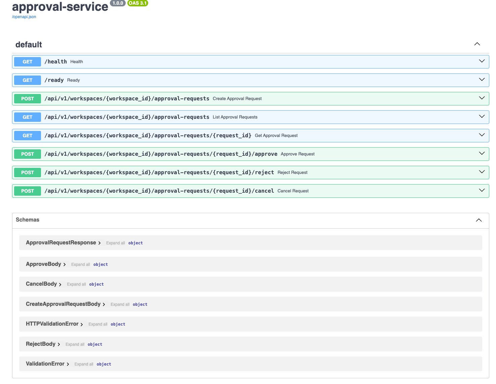

# approval-service

Сервис для согласования контента перед публикацией.

## Что делает сервис

- Создает заявку на согласование.
- Возвращает список заявок в workspace.
- Возвращает одну заявку по `request_id`.
- Принимает финальное решение: `approve`, `reject`, `cancel`.

## Screen



## Быстрый старт

Требования: Python 3.12+.

```bash
python3 -m venv .venv
source .venv/bin/activate
pip install -r requirements.txt
alembic upgrade head
uvicorn app.main:app --reload
```

Сервис поднимется на `http://127.0.0.1:8000`.

Проверка:

```bash
curl http://127.0.0.1:8000/health
curl http://127.0.0.1:8000/ready
```

## Запуск через Docker

```bash
docker compose up --build
```

Сервис: `http://localhost:8000`.

## Авторизация (stub)

Для всех `api/v1` методов обязательны заголовки:

- `X-Auth-Workspace-Id` - workspace пользователя.
- `X-Auth-User-Id` - id пользователя.
- `X-Auth-Actions` - права через запятую.

Права:

- `approval:read` - чтение.
- `approval:create` - создание.
- `approval:decide` - approve/reject.
- `approval:cancel` - cancel.

Дополнительно для создания:

- `X-Idempotency-Key` - защита от дублей при повторном запросе.

## Основные endpoint'ы

- `GET /health`
- `GET /ready`
- `POST /api/v1/workspaces/{workspace_id}/approval-requests`
- `GET /api/v1/workspaces/{workspace_id}/approval-requests`
- `GET /api/v1/workspaces/{workspace_id}/approval-requests/{request_id}`
- `POST /api/v1/workspaces/{workspace_id}/approval-requests/{request_id}/approve`
- `POST /api/v1/workspaces/{workspace_id}/approval-requests/{request_id}/reject`
- `POST /api/v1/workspaces/{workspace_id}/approval-requests/{request_id}/cancel`

## Примеры запросов

Создание:

```bash
curl -X POST "http://127.0.0.1:8000/api/v1/workspaces/ws_1/approval-requests" \
  -H "Content-Type: application/json" \
  -H "X-Auth-Workspace-Id: ws_1" \
  -H "X-Auth-User-Id: usr_admin" \
  -H "X-Auth-Actions: approval:create,approval:read,approval:decide,approval:cancel" \
  -H "X-Idempotency-Key: req-001" \
  -d '{
    "sourceType": "publication",
    "sourceId": "pub_123",
    "title": "Instagram reel draft",
    "description": "Needs final approval",
    "reviewerUserIds": ["usr_1", "usr_2"]
  }'
```

Список:

```bash
curl "http://127.0.0.1:8000/api/v1/workspaces/ws_1/approval-requests" \
  -H "X-Auth-Workspace-Id: ws_1" \
  -H "X-Auth-User-Id: usr_reader" \
  -H "X-Auth-Actions: approval:read"
```

Approve:

```bash
curl -X POST "http://127.0.0.1:8000/api/v1/workspaces/ws_1/approval-requests/<request_id>/approve" \
  -H "Content-Type: application/json" \
  -H "X-Auth-Workspace-Id: ws_1" \
  -H "X-Auth-User-Id: usr_reviewer" \
  -H "X-Auth-Actions: approval:decide" \
  -d '{"comment":"Approved"}'
```

## Тесты

В проекте используются API-тесты на `pytest` + `TestClient` (без внешних сервисов).
Тестовая БД поднимается в памяти (`SQLite`), поэтому тесты выполняются быстро и изолированно.

Покрытые сценарии:

- создание заявки и чтение по `id`;
- изоляция данных между workspace;
- идемпотентное создание по `X-Idempotency-Key` (повтор не создает дубликат);
- запрет изменения финального статуса (например, `reject` после `approve`).

Запуск всех тестов:

```bash
pytest
```

Запуск в подробном режиме:

```bash
pytest -v
```

Запуск одного теста (пример):

```bash
pytest tests/test_api.py::test_idempotency_prevents_duplicates -v
```

Ожидаемый результат:

- статус `passed` для всех тестов;
- в конце вывод вида `4 passed`.

## Поведение и ограничения

- Изоляция по `workspace_id`.
- Идемпотентное создание по `X-Idempotency-Key`.
- Финальное решение нельзя поменять.
- Каждое успешное действие пишется в аудит и outbox.
